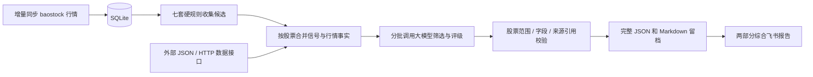

# Sequoia-X: 王者回归 | The King Returns

> A 股硬规则选股 + 大模型评估 + 飞书综合报告

Sequoia-X 先通过七套策略生成候选，再合并同一股票的多策略信号，把规则说明、
后复权行情指标和可追溯的外部资料交给大模型筛选与评级。最终统一发送两部分：

1. **今日推荐购入与短线/长线策略**：A/B/C/D 等级、推荐/观察/剔除，以及短线、
   长线的入场条件、退出条件和判断失效条件。
2. **决策依据**：项目内部规则与行情依据，外部来源的事实摘要、链接、发布时间和可用时间。

项目用于生成评估报告，尚无自动下单、持仓管理或收益回测。评级表示模型的评估
优先级，不代表获利概率；允许所有候选都被观察或剔除。收盘后生成的购入推荐供
后续交易时段复核，程序不会执行交易。

## 工作流程



`--backfill` 模式只获取股票名单并回填历史行情，不调用模型，不发送报告。
日常模式最多用八个进程同步本地股票的缺失行情，然后顺序执行全部策略。
同一股票只评估一次，但保留全部命中策略。超出单批大小的候选会继续分批评估，
不会截掉剩余候选；批次采用相同评级口径，未实现全市场统一 Top-K 优化。

## 内置硬规则

| 策略 | 实际筛选条件 |
|---|---|
| MaVolume | MA5 上穿 MA20，成交量大于含今日的20日均量1.5倍 |
| TurtleTrade | 收盘突破此前20日最高价、成交额过1亿元、收盘同时高于开盘及昨日收盘；按估算流通市值降序 |
| HighTightFlag | 40日高低价比大于1.6、10日高低价比小于1.15、整理区间保持高位、当日缩量；未要求突破 |
| LimitUpShakeout | 昨日涨幅至少9.5%、今日收阴且成交量大于昨日2倍、最低价不低于昨日收盘 |
| UptrendLimitDown | 昨日MA20大于MA60、今日跌幅至少9.5%、成交量大于含今日的20日均量2倍；未要求反包 |
| RpsBreakout | 120根K线收益率排名百分位至少90，收盘不低于120根K线最高价的90%；未要求创出新高 |
| PrivatePlacement | 定向增发的发行日期不早于运行日减7天；依据发行日期而非公告发布日期 |

策略保持 `BaseStrategy.run() -> list[str]` 的原有接口。新增策略时填写
`rule_description`，并在 `main.py` 的列表中注册，评估层自动保留规则说明。

## 安装与配置

要求 Python >= 3.10。

```bash
uv sync --extra dev
# 或
pip install -e ".[dev]"
```

将 `.env.example` 复制为 `.env`，填写 `FEISHU_WEBHOOK_URL`。综合报告优先使用
`STRATEGY_WEBHOOK_REPORT`，未配置时使用默认机器人。日常主流程不再逐策略发送。

### 大模型 API

接口使用兼容 OpenAI Chat Completions 的 HTTP 协议，客户端只依赖现有 `requests`。
它追加 `/chat/completions`，发送 `model`、`messages`、输出 token 上限及可选 JSON mode。
JSON mode 只保证 JSON 格式，业务字段和证据引用仍由本地 Pydantic 及业务校验检查。
协议依据：[OpenAI 官方结构化输出文档](https://developers.openai.com/api/docs/guides/structured-outputs)。

```dotenv
LLM_ENABLED=true
LLM_BASE_URL=https://your-provider.example/v1
LLM_API_KEY=your-key
LLM_MODEL=your-model-name
LLM_BATCH_SIZE=10
LLM_MAX_RETRIES=2
```

`LLM_BASE_URL` 填写服务商实际 API 根地址，示例域名仅用于说明。
支持本地无密钥服务。模型名不预设，按服务商配置填写。
不支持 `response_format` 时设 `LLM_JSON_MODE=false`；要求新 token 字段的模型可设
`LLM_TOKEN_PARAMETER=max_completion_tokens`。`LLM_MAX_TOKENS` 是每批输出上限，
输出截断时应减小 `LLM_BATCH_SIZE` 或增加输出上限。

未启用模型时仍发送综合报告，候选明确标记为“未完成评估”，不会伪造等级或推荐。
模型超时、非法 JSON、拒绝、截断、漏评、重复股票、引用错误都会触发有限重试；
失败批次不形成推荐，成功批次保留并标记报告为部分完成。
如果适配其他协议，继承 `BaseLlmClient.complete()` 并注入 `EvaluationService` 即可。

### 外部依据接口

模型不会自行联网，也不把训练记忆当作今日外部事实。可以接入新闻、公告、财报、
行业及宏观数据聚合服务，或先用本地文件提供资料。

- `EXTERNAL_EVIDENCE_PATH`：UTF-8 JSON 文件路径。
- `EXTERNAL_EVIDENCE_URL`：HTTP POST 接口地址，收到 `symbols` 数组及带时区的
  `as_of` 截止时刻，返回同样的证据 JSON。
- `EXTERNAL_EVIDENCE_API_KEY`：该外部接口专用 Bearer 密钥，与模型密钥独立。

JSON 契约如下，日期与摘要为示例，请替换成实际资料：

```json
{
  "evidence": [
    {
      "evidence_id": "announcement:600000:example-001",
      "symbol": "600000",
      "title": "示例公告标题",
      "source": "公告提供方",
      "url": "https://example.com/announcements/example-001",
      "published_at": "2026-10-02T16:00:00+08:00",
      "available_at": "2026-10-02T16:05:00+08:00",
      "summary": "来自实际原文的事实摘要，包含需要考虑的利好或风险。"
    }
  ]
}
```

`symbol="*"` 表示市场层面的资料。每条证据要求唯一 ID、来源、HTTP(S) 链接与
带时区的发布时间/可用时间。未来资料、超过 `EXTERNAL_EVIDENCE_MAX_AGE_DAYS`
的资料、无关股票及重复 ID 的资料不进入模型。每股最多输入
`EXTERNAL_EVIDENCE_MAX_PER_SYMBOL` 条最新资料，截取情况会写入报告。
如需对接其他平台，继承 `BaseEvidenceProvider.fetch()`；统一时效过滤仍由评估层完成。

模型只能引用输入提供的证据 ID。没有外部来源或没有引用外部资料时，报告明确标记
缺少外部依据。该检查保证引用来自输入，不保证提供方资料真实或模型解释正确；
原始摘要及来源链接保留供核对。只依赖内部依据时仍允许条件式推荐，并标记缺失。

## 运行与留档

```bash
python main.py --backfill  # 首次回填历史行情
python main.py             # 日常同步、规则、评估与综合推送
pytest -q                  # 使用模拟模型、证据和机器人，不调用付费 API
```

建议使用操作系统调度器在交易日收盘后运行，程序没有内置交易日调度器。
日常耗时还取决于候选数量、模型延迟及重试次数，不能沿用规则版的固定耗时估计。

完整快照保存到 `REPORT_DIR`（默认 `data/reports/`），包含策略结果、输入行情、
外部证据和模型评估的 JSON，以及两部分 Markdown；不保存 API 密钥或机器人 URL。
通常两部分放在同一张飞书卡片，过长时按保守字节上限拆成同编号的连续卡片，
发到同一个机器人，全文不会静默截断。推送失败或评估未完整完成返回非零退出码，
便于调度器发现异常；本地报告保留。重复运行会形成新报告并再次发送。

## 数据口径与边界

日 K 数据来自 baostock，采用后复权，SQLite 表为 `stock_daily`。
`turnover` 保存成交额（元），`volume` 保存成交量（股）。模型获得的是分析价格，
计划只能描述相对条件，不能把后复权价格当作实际成交价。
没有本地行情、行情落后于数据库最新日期、数据异常或超过
`LLM_MAX_DATA_AGE_DAYS` 日历天的候选只能观察或剔除，长假需调整时效参数。

增量入库按 `(symbol, date)` 更新，不会删除同日其他股票的已有行情。
日常同步只覆盖已入库股票，新增上市股票需要再次回填以加入股票池。
硬规则采用固定±9.5%阈值，未针对不同股票类别确认实际涨跌停；形态不能证实
洗盘或错杀原因，这些限制同步写入模型提示词。

## 目录结构

```text
main.py                         # 回填或日常评估编排
sequoia_x/
  core/config.py                # 原配置 + 模型/证据/报告配置
  data/engine.py                # 后复权行情、增量同步和 SQLite
  strategy/                     # 七套硬规则，接口保持不变
  evaluation/
    models.py                   # 事实、来源、评级、计划和报告契约
    context.py                  # 合并信号并提取行情指标
    evidence.py                 # 外部 JSON / HTTP 提供者及时间过滤
    client.py                   # 抽象 API 接口与兼容 HTTP 客户端
    prompt.py                   # 统一评级标准与事实约束
    service.py                  # 分批调用、重试及业务校验
    report.py                   # 两部分渲染与本地留档
  notify/feishu.py               # 综合报告卡片与超长分页
tests/                          # 原属性测试及评估链路离线测试
```

## 许可证

MIT
